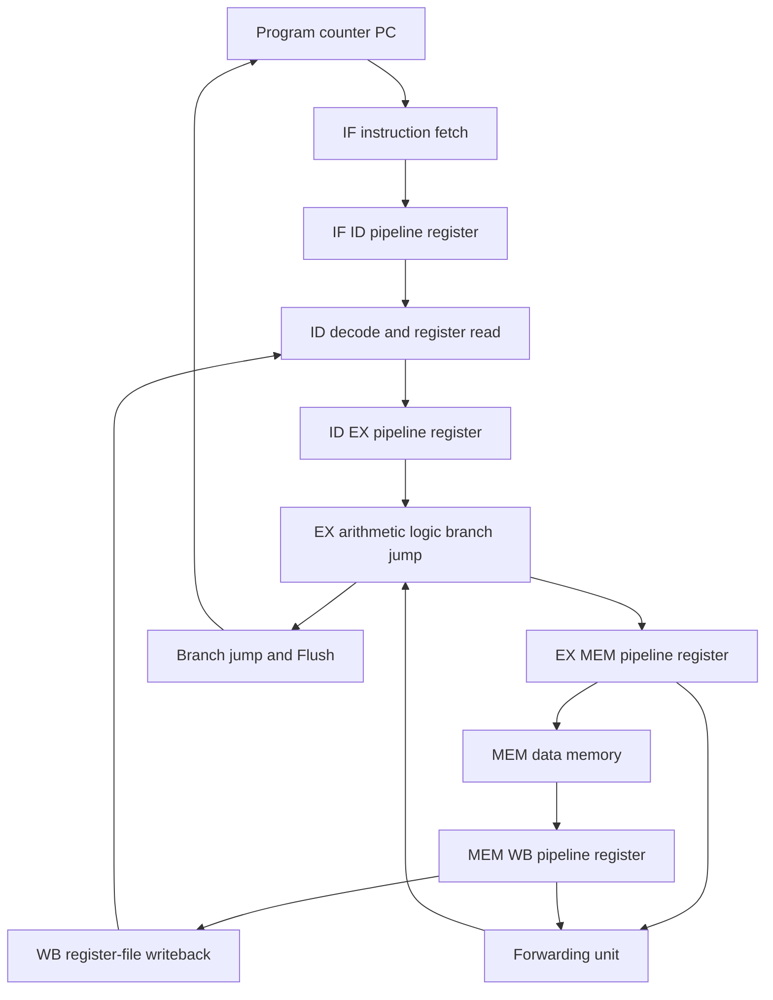

<div align="center">


Figure 1 Tiny Tapeout five-stage pipeline CPU project entry

<h1>RISC-V Five-Stage Pipeline CPU</h1>

<p><strong>A 32-bit five-stage pipelined processor for Tiny Tapeout with serial memory programming and seven-segment output</strong></p>

<p>All figures in this document come from the default-branch source, configuration, tests, and the 2026-08-24 local rerun</p>

<p>
  <a href="README.md">简体中文</a> ·
  <a href="#architecture-en">Pipeline architecture</a> ·
  <a href="#instructions-en">Instruction subset</a> ·
  <a href="#uart-en">Serial protocol</a> ·
  <a href="#simulation-en">Simulation</a>
</p>

<p>
  
  
  
  
  
</p>

<p>
  <a href="https://github.com/AIALRA-0/tt08-verilog-riscv-pipeline-cpu-aialra-main/actions/workflows/test.yaml"></a>
  <a href="https://github.com/AIALRA-0/tt08-verilog-riscv-pipeline-cpu-aialra-main/actions/workflows/gds.yaml"></a>
  <a href="https://github.com/AIALRA-0/tt08-verilog-riscv-pipeline-cpu-aialra-main/actions/workflows/docs.yaml"></a>
</p>

</div>

> [!IMPORTANT]
> The design documents 45 RV32I-style and M-extension instructions, but does not implement complete RV32I, CSRs, exceptions, or a privileged architecture
> Five load instructions have a known load-use hazard and currently require at least one inserted `nop`

## 1 Project overview

The project wraps a 32-bit RISC-V-style processor, a UART memory-access channel, and seven-segment output in the standard Tiny Tapeout top level
The processor has IF, ID, EX, MEM, and WB stages and includes EX-stage data forwarding [1]

<div align="center">

Table 1.1 Implementation snapshot

| Dimension | Current implementation | Evidence |
| --- | --- | --- |
| Data width | 32 bits | `RISCV_Pipeline_CPU.v` |
| Pipeline | IF, ID, EX, MEM, WB | Pipeline registers and module wiring |
| Instruction memory | Depth 64 in the wrapper instance | `project.v` |
| Data memory | Depth 32 in the wrapper instance | `project.v` |
| Instruction set | 45 documented instructions | README and control-logic review |
| Data hazards | EX-stage forwarding | `Forwarding_Unit.v` |
| External programming | Custom 12-bit serial frames access both memories | UART modules and testbench |
| Visual output | Low nibble of data-memory word 0 drives seven segments | `project.v` |
| Tiny Tapeout area | `8x2` tiles | `info.yaml` |
| License | Apache License 2.0 | `LICENSE` |

</div>

<a id="architecture-en"></a>

## 2 Pipeline architecture

<div align="center">


Figure 2.1 Five-stage pipeline reference image stored in the repository

</div>

This image explains processor data flow and is not a netlist diagram generated from the current RTL
The original README's remote synthesis attachment was unavailable during this review, so the new page no longer depends on that dead asset

<div align="center">



Figure 2.2 Five-stage pipeline, forwarding, and control loop

</div>

## 3 Stage responsibilities

<div align="center">

Table 3.1 Pipeline stages

| Stage | Main work | Key modules |
| --- | --- | --- |
| IF | Read the program counter and instruction memory | `PC.v`, `Instruction_Memory.v` |
| ID | Decode, read registers, and generate immediates | `Control_Unit.v`, `Register_File.v`, `Immediate_Generator.v` |
| EX | Execute arithmetic, compare, calculate jump addresses, and select forwarded data | `ALU.v`, `ALU_Control.v`, `Forwarding_Unit.v` |
| MEM | Read or write data memory | `Data_Memory.v`, `Data_Memory_Handler.v` |
| WB | Select among ALU, memory, and immediate results and write back | `pipeline_register.v` and writeback multiplexers |

</div>

`ui_in[0]` provides `enable` for program-counter progress
The Tiny Tapeout wrapper converts active-low `rst_n` to the internal active-high reset

<a id="instructions-en"></a>

## 4 Instruction subset

Official RISC-V naming calls the 32-bit base integer set RV32I and the integer multiplication and division extension M [1], [2]
This project implements a documented subset and must not be labeled complete RV32IM from instruction names alone

<div align="center">

Table 4.1 Forty-five documented instructions

| Category | Instructions | Meaning |
| --- | --- | --- |
| Integer arithmetic | `add`, `sub`, `addi` | Register and immediate addition or subtraction |
| Bit logic | `and`, `or`, `xor`, `andi`, `ori`, `xori` | Bitwise logic operations |
| Shifts | `sll`, `srl`, `sra`, `slli`, `srli`, `srai` | Logical and arithmetic shifts |
| Comparisons | `slt`, `sltu`, `slti`, `sltiu` | Signed and unsigned less-than comparisons |
| Conditional branches | `beq`, `bne`, `blt`, `bge`, `bltu`, `bgeu` | Equality and magnitude branches |
| Jumps | `jal`, `jalr` | Immediate and register-indirect jumps with link writeback |
| Upper immediates | `lui`, `auipc` | Construct upper immediates and PC-relative addresses |
| Loads | `lw`, `lb`, `lh`, `lbu`, `lhu` | Word, byte, and halfword loads with manual load-use avoidance |
| Stores | `sw`, `sb`, `sh` | Word, byte, and halfword stores |
| M extension | `mul`, `mulh`, `mulhu`, `mulhsu`, `div`, `divu`, `rem`, `remu` | Signed and unsigned multiply, divide, and remainder |

</div>

## 5 Processor boundaries

<div align="center">

Table 5.1 Known processor boundaries

| Area | Current behavior | Impact |
| --- | --- | --- |
| EX data hazards | Forwarding selects EX/MEM or MEM/WB results | Covers selected register dependencies |
| Load-use hazards | `lw`, `lb`, `lh`, `lbu`, and `lhu` require at least one `nop` afterward | Compiler or program author must insert the stall |
| Control hazards | Branch and jump logic produces `Flush` | Each control sequence still requires tests |
| CSR and SYSTEM | Not implemented | Software that requires CSRs or system calls cannot run |
| Exceptions and interrupts | No implementation recorded | This is not a general execution environment |
| Multiple issue | Not implemented | One pipeline path progresses per cycle |
| Out-of-order execution | Not implemented | Instructions remain in order |
| Timing optimization | Still on the roadmap | A configuration constraint is not signed-off frequency evidence |

</div>

<a id="uart-en"></a>

## 6 Serial memory protocol

While the processor is paused, a test host can use `ui_in[1]` to read or write instruction and data memory
The source configures each serial frame for 12 payload bits rather than the eight data bits of standard 8N1

<div align="center">


Figure 6.1 Serial-frame reference image retained in the repository

</div>

Figure 6.1 is an early 8N1 reference illustration
The current RTL and Cocotb test use 12-bit data frames, so the width mismatch is documentation debt that should be corrected in the source image

<div align="center">

Table 6.1 Twelve-bit handshake frame

| Field | Meaning | Current encoding |
| --- | --- | --- |
| `bit 11` | Read or write direction | `1` for write, `0` for read |
| `bit 10` | Handshake marker | Fixed to `1` |
| `bit 9` | Target memory | `1` for instruction, `0` for data |
| `bits 8:0` | Target address | Nine-bit address field |

</div>

A write sends four 12-bit frames after the handshake, with the low eight bits of each frame carrying one data byte
A read returns the handshake and then four data frames

## 7 Tiny Tapeout interface

The standard Tiny Tapeout top level provides eight dedicated inputs, eight dedicated outputs, and eight bidirectional pins [3]

<div align="center">

Table 7.1 Pin mapping

| Pin | Direction | Current use |
| --- | --- | --- |
| `ui_in[0]` | Input | CPU `enable` |
| `ui_in[1]` | Input | `uart_rx` |
| `ui_in[7:2]` | Input | Unused |
| `uo_out[6:0]` | Output | Seven-segment lines |
| `uo_out[7]` | Output | Tied to `0` |
| `uio_out[0]` | Bidirectional-group output | `uart_tx` |
| `uio_out[7:1]` | Bidirectional-group output | Tied to `0` |
| `uio_oe[7:0]` | Direction control | All currently set to output |
| `clk` | Input | Global clock |
| `rst_n` | Input | Active-low reset |

</div>

The top module is `tt_um_aialra_riscv_pipeline_cpu`
Tiny Tapeout metadata lists 21 Verilog sources; `src/` contains one additional display-counter module that is not in the chip source list

## 8 Physical clock evidence

<div align="center">

Table 8.1 Clock evidence

| Source | Value | Interpretation |
| --- | ---: | --- |
| `info.yaml` | 100 MHz | Target clock in project-interface metadata |
| `test/test.py` | 10 ns period, or 100 MHz | Ideal clock used by RTL simulation |
| `src/config.json` | 20 ns period, or 50 MHz | OpenLane physical implementation constraint |
| Current review | No timing sign-off run | No claim that silicon or gate-level operation reaches 100 MHz |

</div>

Physical configuration uses `8x2` tiles, 0.6 target density, `met4` as the highest routing layer, and absolute sizing
The config disables KLayout XOR and DRC while relying on other Tiny Tapeout prechecks, so final manufacturability must follow remote GDS and precheck results

<a id="simulation-en"></a>

## 9 Quick simulation

Simulation requires Icarus Verilog, Python, Cocotb 1.8.1, and Pytest 8.2.2
The current Makefile does not handle spaces in the absolute checkout path, so place the working copy in a path without spaces

1. Step 1: create an isolated Python environment

```bash
python3 -m venv .venv # Create a repository-specific Python environment
. .venv/bin/activate # Activate the isolated environment in the current shell
python -m pip install -r test/requirements.txt # Install the pinned Cocotb and Pytest versions
```

2. Step 2: run RTL simulation

```bash
make -C test clean # Remove artifacts from the previous RTL simulation
make -C test # Compile the top level, load test/program.mem, and run the Cocotb smoke test
```

3. Step 3: inspect the waveform

```bash
gtkwave test/tb.vcd test/tb.gtkw # Open the VCD with the repository waveform layout
```

## 10 Test evidence

On 2026-08-24, the existing RTL test was rerun from a no-space temporary path with Icarus Verilog 12.0, Python 3.12.3, and Cocotb 1.8.1

<div align="center">

Table 10.1 Current verification results

| Check | Result | Conclusion boundary |
| --- | --- | --- |
| RTL compilation | Passed | Twenty-one Tiny Tapeout-listed sources and the testbench compiled |
| Cocotb test | 1 passed, 0 failed | Simulation completed normally at 110,210 ns |
| UART instruction-memory readback | Log matched | Address 1 returned the fixed program value |
| UART data-memory readback | Log matched | Address 14 returned the fixed write value |
| Program fixtures | 12 `.mem` files | Only `test/program.mem` runs automatically by default |
| Python assertions | 0 | The test is log-oriented and does not prove all 45 instructions correct |
| Remote RTL workflow | Passed | GitHub Actions completed Icarus and Cocotb verification on commit `3ad2355` |
| Gate-level simulation | Not run | The GDS flow stopped before the gate-level stage |
| GDS and precheck | Failed | OpenROAD reported 135.30% placement utilization, above 100% |
| Datasheet build | Failed | The Tiny Tapeout docs action could not find the `typst` executable |

</div>

The first local attempt from a workspace path containing spaces failed before compilation because Make split the path into targets
The same commit passed after export to a no-space temporary path, identifying a build-path compatibility problem rather than an RTL test failure

## 11 Repository structure

<div align="center">

Table 11.1 Main paths

| Path | Contents |
| --- | --- |
| `src/` | CPU, memories, pipeline registers, UART, and seven-segment RTL |
| `test/test.py` | Cocotb driver, UART reads and writes, and execution loop |
| `test/tb.v` | Tiny Tapeout test top level |
| `test/program.mem` | Default simulation program |
| `test/test programs/` | Branch, compare, shift, multiply/divide, forwarding, memory, and display fixtures |
| `docs/info.md` | Tiny Tapeout datasheet body |
| `docs/ref_architecture.png` | Pipeline reference image |
| `docs/customized_uart.png` | Early serial-frame reference image |
| `info.yaml` | Project, source-file, and pin metadata |
| `src/config.json` | OpenLane physical configuration |
| `.github/workflows/` | RTL, GDS, docs, and manual FPGA workflows |

</div>

## 12 Automation workflows

<div align="center">

Table 12.1 GitHub Actions

| Workflow | Trigger | Artifact or check |
| --- | --- | --- |
| `test.yaml` | Push or manual | Icarus RTL simulation, JUnit result, and VCD |
| `gds.yaml` | Push or manual | OpenLane 2 GDS, Tiny Tapeout precheck, gate-level test, and viewer |
| `docs.yaml` | Push or manual | Tiny Tapeout project datasheet |
| `fpga.yaml` | Manual only | ICE40UP5K bitstream for TT ASIC Sim |

</div>

All four workflows are active, with the FPGA workflow available only by manual dispatch
For commit `3ad2355`, the RTL workflow passed, the GDS workflow stopped at 135.30% placement utilization, and the docs workflow stopped because its environment lacked `typst`
Both failures are outside the README change itself and remain visible through failure badges so incomplete delivery is not presented as success

## 13 Development roadmap

The original roadmap's complete instruction support, system operations, multiple issue, out-of-order execution, and timing optimization remain unfinished
Verification gaps should close before the microarchitecture expands

<div align="center">

Table 13.1 Suggested priorities

| Priority | Work | Acceptance condition |
| ---: | --- | --- |
| 1 | Add assertions for UART readback and instruction results | Incorrect data fails the test |
| 2 | Parameterize all 12 program fixtures into regression | Every instruction class and hazard scenario has an expected result |
| 3 | Handle load-use stalls automatically | Dependent programs pass without handwritten `nop` instructions |
| 4 | Fix Makefile support for paths with spaces | Standard workspace and temporary-path results match |
| 5 | Update the 12-bit serial diagram and protocol tests | Image, RTL, and test bit definitions align |
| 6 | Define the complete ISA subset and illegal-instruction behavior | Instruction matrix maps to observable hardware behavior |
| 7 | Complete gate-level, timing, and precheck evidence | Frequency statements map to a report and commit |

</div>

## 14 Security rules

This revision replaces personal names and chat identifiers in public metadata and RTL headers with organization-level attribution or blank values
The project identifier in the top-module name remains because it is part of the Tiny Tapeout design identity

- Do not commit real chat handles, personal email addresses, user identifiers, or local paths
- Do not commit private PDK paths, license keys, access tokens, or CI secrets
- Use synthetic programs and public hardware identifiers in waveforms, logs, and screenshots
- Do not place real device data or user content in test programs
- Localize remote attachments and inspect pixels, format, and metadata before adding them to the README
- Historical commits still contain old public fields; complete removal would require a separate history-rewrite risk review

## 15 Project governance

- Step 1: describe the instruction, hazard scenario, or interface behavior to change in an issue

- Step 2: add a program fixture and explicit assertion that can fail before changing RTL

- Step 3: modify the smallest RTL scope and update instruction, pin, and protocol documentation

- Step 4: run RTL regression and await GDS, precheck, and gate-level workflows after physical changes

- Step 5: inspect source headers, logs, waveforms, images, and commit diffs for identity and secret fields

The project is distributed under the Apache License 2.0; see `LICENSE` for the complete terms

### 15.1 References

[1] RISC-V International, “RV32I Base Integer Instruction Set, Version 2.1.” [Online]. Available: https://docs.riscv.org/reference/isa/unpriv/rv32.html

[2] RISC-V International, “ISA Extension Naming Conventions.” [Online]. Available: https://docs.riscv.org/reference/isa/unpriv/naming.html

[3] Tiny Tapeout, “HDL Project Interface Requirements.” [Online]. Available: https://tinytapeout.com/hdl/important/

[4] Cocotb Project, “Cocotb Documentation.” [Online]. Available: https://docs.cocotb.org/en/stable/
