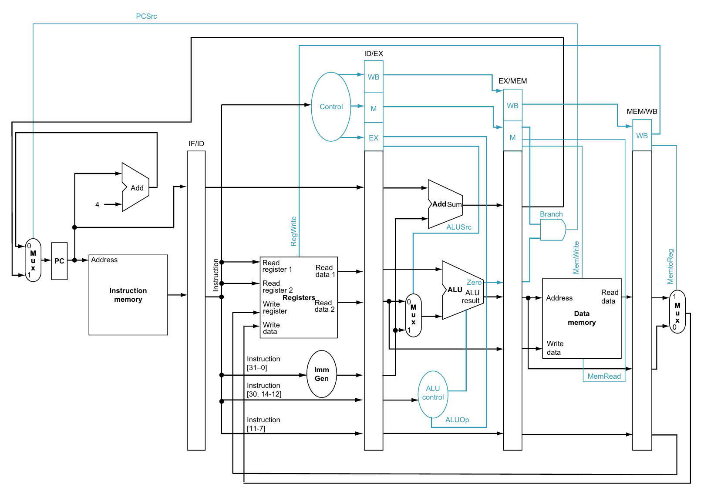
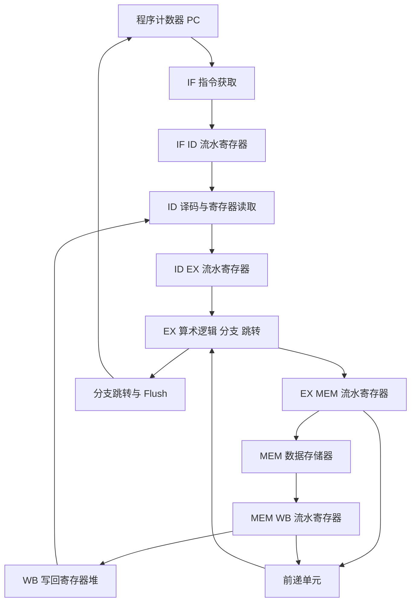
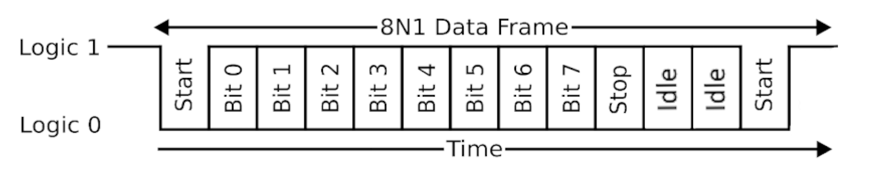

<div align="center">


图 1 Tiny Tapeout 五级流水线 CPU 项目入口

<h1>RISC-V 五级流水线 CPU</h1>

<p><strong>面向 Tiny Tapeout 的 32 位五级流水线处理器，集成串行存储器编程和七段数码管输出</strong></p>

<p>本文全部数值来自 2026-08-24 默认分支源码、配置、测试文件和本地复跑记录</p>

<p>
  <a href="README.en.md">English</a> ·
  <a href="#architecture-cn">流水线架构</a> ·
  <a href="#instructions-cn">指令子集</a> ·
  <a href="#uart-cn">串行协议</a> ·
  <a href="#simulation-cn">仿真验证</a>
</p>

<p>
  
  
  
  
  
</p>

<p>
  <a href="https://github.com/AIALRA-0/tt08-verilog-riscv-pipeline-cpu-aialra-main/actions/workflows/test.yaml"></a>
  <a href="https://github.com/AIALRA-0/tt08-verilog-riscv-pipeline-cpu-aialra-main/actions/workflows/gds.yaml"></a>
  <a href="https://github.com/AIALRA-0/tt08-verilog-riscv-pipeline-cpu-aialra-main/actions/workflows/docs.yaml"></a>
</p>

</div>

> [!IMPORTANT]
> 本设计记录了 45 条 RV32I 风格和 M 扩展指令，但没有实现完整 RV32I、CSR、异常或特权体系
> 五类加载指令存在已知 load-use 风险，当前程序需要至少插入一条 `nop`

## 1 项目概览

项目把 32 位 RISC-V 风格处理器、UART 存储器访问通道和七段数码管输出封装到 Tiny Tapeout 标准顶层
处理器使用 IF、ID、EX、MEM 和 WB 五级流水线，并在 EX 阶段加入数据前递 [1]

<div align="center">

表 1.1 实现快照

| 维度 | 当前实现 | 证据 |
| --- | --- | --- |
| 数据宽度 | 32 位 | `RISCV_Pipeline_CPU.v` |
| 流水线 | IF、ID、EX、MEM、WB | 流水寄存器和模块连线 |
| 指令存储器 | 顶层实例化深度 64 | `project.v` |
| 数据存储器 | 顶层实例化深度 32 | `project.v` |
| 指令集合 | 文档列出 45 条 | README 与控制逻辑复核 |
| 数据相关 | EX 阶段前递 | `Forwarding_Unit.v` |
| 外部编程 | 自定义 12 位串行帧访问两类存储器 | UART 模块和测试台 |
| 可视输出 | 数据存储器第 0 项低四位驱动七段数码管 | `project.v` |
| Tiny Tapeout 面积 | `8x2` tiles | `info.yaml` |
| 许可证 | Apache License 2.0 | `LICENSE` |

</div>

<a id="architecture-cn"></a>

## 2 流水线架构

<div align="center">



图 2.1 仓库中的五级流水线参考图

</div>

该图片用于解释处理器数据流，不是从当前 RTL 自动生成的综合网表图
原 README 的远程综合示意附件在本轮复核时已经无法访问，因此没有继续依赖失效资源

<div align="center">



图 2.2 五级流水线、前递和控制回路

</div>

## 3 阶段职责

<div align="center">

表 3.1 流水阶段

| 阶段 | 主要动作 | 关键模块 |
| --- | --- | --- |
| IF | 读取程序计数器和指令存储器 | `PC.v`、`Instruction_Memory.v` |
| ID | 译码、读取寄存器和生成立即数 | `Control_Unit.v`、`Register_File.v`、`Immediate_Generator.v` |
| EX | 执行算术逻辑、比较、跳转地址和前递选择 | `ALU.v`、`ALU_Control.v`、`Forwarding_Unit.v` |
| MEM | 读取或写入数据存储器 | `Data_Memory.v`、`Data_Memory_Handler.v` |
| WB | 在 ALU、存储器和立即数结果之间选择并写回 | `pipeline_register.v` 与写回多路选择 |

</div>

`enable` 通过 `ui_in[0]` 控制程序计数器推进
复位输入 `rst_n` 在 Tiny Tapeout 包装层中转换为内部高电平复位

<a id="instructions-cn"></a>

## 4 指令子集

RISC-V 官方命名把基础 32 位整数集合称为 RV32I，把整数乘除扩展称为 M [1], [2]
本项目实现的是文档化子集，不能仅凭指令名称标记为完整 RV32IM

<div align="center">

表 4.1 已记录的 45 条指令

| 类别 | 指令 | 说明 |
| --- | --- | --- |
| 整数算术 | `add`、`sub`、`addi` | 寄存器和立即数加减 |
| 位逻辑 | `and`、`or`、`xor`、`andi`、`ori`、`xori` | 按位逻辑运算 |
| 移位 | `sll`、`srl`、`sra`、`slli`、`srli`、`srai` | 逻辑与算术移位 |
| 比较 | `slt`、`sltu`、`slti`、`sltiu` | 有符号和无符号小于比较 |
| 条件分支 | `beq`、`bne`、`blt`、`bge`、`bltu`、`bgeu` | 相等和大小关系分支 |
| 跳转 | `jal`、`jalr` | 立即数和寄存器间接跳转并写回链接地址 |
| 高位立即数 | `lui`、`auipc` | 构造高位立即数和 PC 相对地址 |
| 加载 | `lw`、`lb`、`lh`、`lbu`、`lhu` | 字、字节和半字读取，当前需要手动规避 load-use 风险 |
| 存储 | `sw`、`sb`、`sh` | 字、字节和半字写入 |
| M 扩展 | `mul`、`mulh`、`mulhu`、`mulhsu`、`div`、`divu`、`rem`、`remu` | 有符号和无符号乘法、除法与余数 |

</div>

## 5 处理器边界

<div align="center">

表 5.1 已知处理器边界

| 范围 | 当前行为 | 影响 |
| --- | --- | --- |
| EX 数据相关 | 通过前递单元选择 EX/MEM 或 MEM/WB 结果 | 覆盖部分寄存器相关 |
| load-use 相关 | `lw`、`lb`、`lh`、`lbu`、`lhu` 后需要至少一条 `nop` | 编译器或程序作者必须主动插入停顿 |
| 控制相关 | 分支和跳转逻辑产生 `Flush` | 需要结合测试确认每种跳转序列 |
| CSR 与 SYSTEM | 未实现 | 不能运行依赖控制状态寄存器或系统调用的软件 |
| 异常和中断 | 未记录实现 | 不提供通用执行环境 |
| 多发射 | 未实现 | 每周期只沿单条流水路径推进 |
| 乱序执行 | 未实现 | 指令保持顺序流水 |
| 时序优化 | 路线中待完成 | 配置约束不等同于签核频率 |

</div>

<a id="uart-cn"></a>

## 6 串行存储器协议

处理器暂停时，测试端可以通过 `ui_in[1]` 写入或读取指令存储器与数据存储器
源码把每个串行帧的有效载荷宽度设为 12 位，而不是标准 8N1 的 8 位数据宽度

<div align="center">



图 6.1 仓库保留的串行帧参考图

</div>

图 6.1 是早期 8N1 参考示意
当前 RTL 和 Cocotb 测试以 12 位数据帧为准，帧宽差异属于需要更新原图的文档债务

<div align="center">

表 6.1 12 位握手帧

| 位段 | 含义 | 当前编码 |
| --- | --- | --- |
| `bit 11` | 读写方向 | `1` 写入，`0` 读取 |
| `bit 10` | 握手标记 | 固定为 `1` |
| `bit 9` | 目标存储器 | `1` 指令存储器，`0` 数据存储器 |
| `bits 8:0` | 目标地址 | 9 位地址字段 |

</div>

写入操作在握手后发送四个 12 位帧，每帧低 8 位承载一个数据字节
读取操作先返回握手帧，再返回四个数据帧

## 7 Tiny Tapeout 接口

Tiny Tapeout 标准顶层提供 8 个专用输入、8 个专用输出和 8 个双向引脚 [3]

<div align="center">

表 7.1 引脚映射

| 引脚 | 方向 | 当前用途 |
| --- | --- | --- |
| `ui_in[0]` | 输入 | CPU `enable` |
| `ui_in[1]` | 输入 | `uart_rx` |
| `ui_in[7:2]` | 输入 | 未使用 |
| `uo_out[6:0]` | 输出 | 七段数码管段线 |
| `uo_out[7]` | 输出 | 固定为 `0` |
| `uio_out[0]` | 双向组输出 | `uart_tx` |
| `uio_out[7:1]` | 双向组输出 | 固定为 `0` |
| `uio_oe[7:0]` | 方向控制 | 当前全部设为输出 |
| `clk` | 输入 | 全局时钟 |
| `rst_n` | 输入 | 低电平有效复位 |

</div>

顶层模块名是 `tt_um_aialra_riscv_pipeline_cpu`
Tiny Tapeout 元数据只列入 21 个 Verilog 源文件，`src/` 中另有一个未进入芯片源清单的显示计数模块

## 8 物理时钟证据

<div align="center">

表 8.1 时钟证据

| 来源 | 数值 | 应如何理解 |
| --- | ---: | --- |
| `info.yaml` | 100 MHz | 项目接口元数据中的目标时钟 |
| `test/test.py` | 10 ns 周期，即 100 MHz | RTL 仿真使用的理想时钟 |
| `src/config.json` | 20 ns 周期，即 50 MHz | OpenLane 物理实现约束 |
| 本轮结果 | 未做时序签核 | 不声明硅后或门级达到 100 MHz |

</div>

物理配置使用 `8x2` tiles、0.6 目标密度、`met4` 最高布线层和绝对尺寸模式
配置关闭了 KLayout XOR 和 DRC，并启用其他 Tiny Tapeout 预检流程，因此最终制造判断需要以远程 GDS 与预检结果为准

<a id="simulation-cn"></a>

## 9 快速仿真

仿真依赖 Icarus Verilog、Python、Cocotb 1.8.1 和 Pytest 8.2.2
当前 Makefile 不能正确处理仓库绝对路径中的空格，建议把工作副本放到无空格路径

1. 第一步，建立隔离 Python 环境

```bash
python3 -m venv .venv # 创建仓库专用 Python 环境
. .venv/bin/activate # 激活当前 Shell 中的隔离环境
python -m pip install -r test/requirements.txt # 安装锁定的 Cocotb 与 Pytest 版本
```

2. 第二步，运行 RTL 仿真

```bash
make -C test clean # 删除上一次 RTL 仿真生成物
make -C test # 编译顶层、加载 test/program.mem 并执行 Cocotb 冒烟测试
```

3. 第三步，查看波形

```bash
gtkwave test/tb.vcd test/tb.gtkw # 使用仓库波形配置打开 VCD 文件
```

## 10 测试证据

2026-08-24 在无空格临时路径使用 Icarus Verilog 12.0、Python 3.12.3 和 Cocotb 1.8.1 复跑现有 RTL 测试

<div align="center">

表 10.1 本轮验证结果

| 检查 | 结果 | 结论边界 |
| --- | --- | --- |
| RTL 编译 | 通过 | 21 个 Tiny Tapeout 清单源文件和测试台完成编译 |
| Cocotb 测试 | 1 通过、0 失败 | 测试运行到 110,210 ns 并正常结束 |
| UART 指令存储器读回 | 日志匹配 | 地址 1 读回固定程序值 |
| UART 数据存储器读回 | 日志匹配 | 地址 14 读回固定写入值 |
| 程序样例 | 12 个 `.mem` 文件 | 只有 `test/program.mem` 默认自动运行 |
| Python 断言 | 0 | 当前测试主要依赖日志，不足以证明 45 条指令全部正确 |
| 远端 RTL 工作流 | 通过 | GitHub Actions 在提交 `3ad2355` 上完成 Icarus 与 Cocotb 验证 |
| 门级仿真 | 未执行 | GDS 流程在进入门级阶段前停止 |
| GDS 与预检 | 未通过 | OpenROAD 报告布局利用率为 135.30%，超过 100% |
| 数据表构建 | 未通过 | Tiny Tapeout 文档动作运行时缺少 `typst` 可执行文件 |

</div>

本轮第一次在带空格的工作区运行时，Makefile 把路径拆成多个目标并在编译前失败
同一提交移动到无空格临时路径后测试通过，说明该失败属于构建路径兼容问题

## 11 仓库结构

<div align="center">

表 11.1 主要路径

| 路径 | 内容 |
| --- | --- |
| `src/` | CPU、存储器、流水寄存器、UART 和七段数码管 RTL |
| `test/test.py` | Cocotb 驱动、UART 读写和执行循环 |
| `test/tb.v` | Tiny Tapeout 测试顶层 |
| `test/program.mem` | 默认仿真程序 |
| `test/test programs/` | 分支、比较、移位、乘除、前递、存储器和显示样例 |
| `docs/info.md` | Tiny Tapeout 数据表正文 |
| `docs/ref_architecture.png` | 流水线参考图 |
| `docs/customized_uart.png` | 早期串行帧参考图 |
| `info.yaml` | 项目、源文件和引脚元数据 |
| `src/config.json` | OpenLane 物理实现配置 |
| `.github/workflows/` | RTL、GDS、文档和手动 FPGA 流程 |

</div>

## 12 自动化流程

<div align="center">

表 12.1 GitHub Actions

| 工作流 | 触发方式 | 交付物或检查 |
| --- | --- | --- |
| `test.yaml` | 推送或手动 | Icarus RTL 仿真、JUnit 结果和 VCD |
| `gds.yaml` | 推送或手动 | OpenLane 2 GDS、Tiny Tapeout 预检、门级测试和查看器 |
| `docs.yaml` | 推送或手动 | Tiny Tapeout 项目数据表 |
| `fpga.yaml` | 仅手动 | ICE40UP5K 的 TT ASIC Sim 位流 |

</div>

四个工作流均处于启用状态，其中 FPGA 流程仅支持手动触发
提交 `3ad2355` 的 RTL 工作流通过，GDS 工作流因布局利用率达到 135.30% 而停止，文档工作流因运行环境缺少 `typst` 而停止
这两个失败都发生在 README 之外的既有实现或上游动作边界，当前页面保留失败徽章，避免把未完成交付显示成成功

## 13 开发路线

原项目路线中的完整指令支持、系统操作、多发射、乱序执行和时序优化仍未完成
建议先关闭可验证性缺口，再扩展微架构

<div align="center">

表 13.1 建议优先级

| 优先级 | 工作 | 验收条件 |
| ---: | --- | --- |
| 1 | 为 UART 读回和指令结果增加断言 | 错误数据能够让测试失败 |
| 2 | 把 12 个程序样例纳入参数化回归 | 每类指令和相关场景有预期结果 |
| 3 | 自动处理 load-use 停顿 | 无需手写 `nop` 的相关程序通过 |
| 4 | 修复带空格路径的 Makefile | 标准工作区和临时路径结果一致 |
| 5 | 更新 12 位串行帧图和协议测试 | 图片、RTL 和测试位定义一致 |
| 6 | 完整定义 ISA 子集和非法指令行为 | 指令矩阵与硬件行为可核对 |
| 7 | 完成门级、时序和预检证据 | 频率声明关联具体报告和提交 |

</div>

## 14 安全准则

本轮把公开元数据和 RTL 头部中的个人姓名、聊天账号改为组织级归属或空值
顶层模块名中的项目标识属于 Tiny Tapeout 设计标识，因此继续保留

- 不提交真实聊天账号、个人邮箱、用户标识或本机路径
- 不提交 PDK 私有路径、许可证密钥、访问令牌或 CI 秘密
- 波形、日志和截图只使用合成程序与公开硬件标识
- 测试程序不得包含真实设备数据或用户内容
- 远程附件进入 README 前需要本地化并检查像素、格式和元数据
- 历史提交仍保留旧公开字段，若需要彻底清理应单独评估历史重写影响

## 15 项目治理

- 第一步，在议题中说明要修复的指令、相关场景或接口行为

- 第二步，先加入能够失败的程序样例和明确断言

- 第三步，修改最小 RTL 范围，并同步更新指令、引脚和协议文档

- 第四步，运行 RTL 回归，并在物理配置变化时等待 GDS、预检和门级流程

- 第五步，检查源码头部、日志、波形、图片和提交差异中的身份与秘密字段

项目依据 Apache License 2.0 发布，完整条款见 `LICENSE`

### 15.1 引用

[1] RISC-V International, “RV32I Base Integer Instruction Set, Version 2.1.” [Online]. Available: https://docs.riscv.org/reference/isa/unpriv/rv32.html

[2] RISC-V International, “ISA Extension Naming Conventions.” [Online]. Available: https://docs.riscv.org/reference/isa/unpriv/naming.html

[3] Tiny Tapeout, “HDL Project Interface Requirements.” [Online]. Available: https://tinytapeout.com/hdl/important/

[4] Cocotb Project, “Cocotb Documentation.” [Online]. Available: https://docs.cocotb.org/en/stable/
